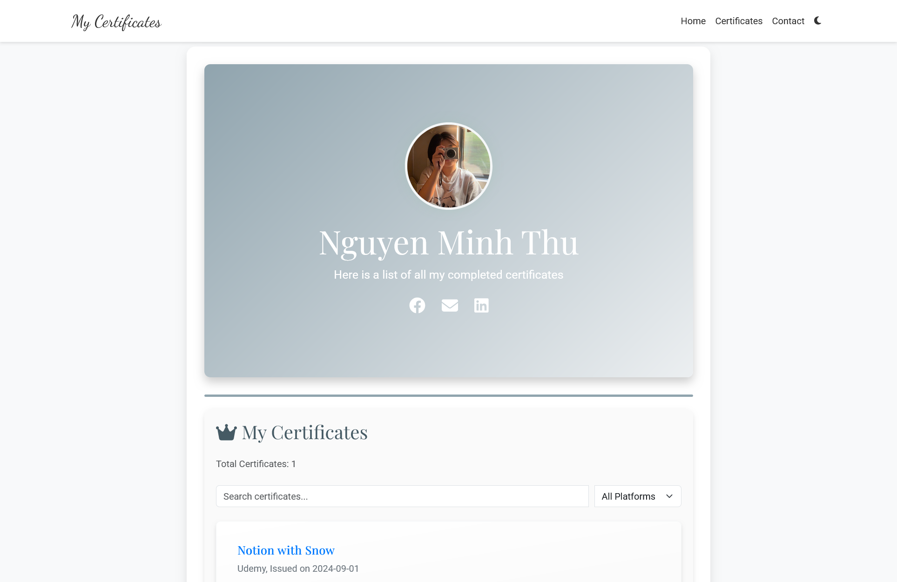

# My Certificates

This project is a personal web page that showcases the certificates I have earned. The site is built using Flask and Jinja2, and it dynamically updates data from a Google Sheets document.

Visit the portfolio at: [Nguyen Minh Thu | Certificates Portfolio](https://nguyenmthuu.github.io/certificates/)

## Features

-   **Dynamic Data:** Automatically updated from a Google Sheets document.
-   **Responsive Design:** Adapts to different screen sizes for an optimal viewing experience.
-   **Interactive Effects:** Includes animations and hover effects for a more engaging user experience.

## Demo

## License

This project is licensed under the MIT License - see the [LICENSE](LICENSE) file for details.
